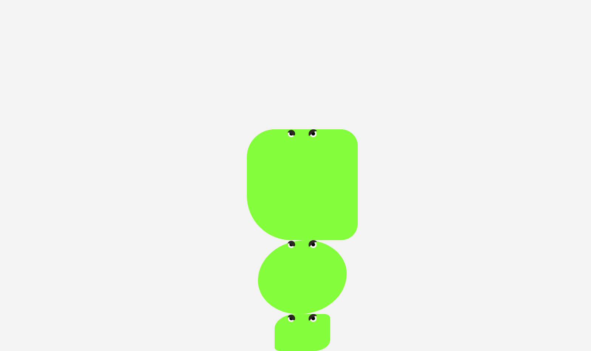

# Boss: Slime Infection

## Boss description (Descrição do chefão)

### Specifications (Especificações)
  * Difficulty (Dificuldade): Nível Slime King
  * Roadmap (Trilha): Front-end estático
  * Topics covered (Assuntos abordados): 
    * Specificity, Cascata e herança
    * Box-model
    * Flexbox

### Report (Relato)

Seu computador foi infectado por um [adware](https://pt.wikipedia.org/wiki/Adware), mas, o [hacker](https://pt.wikipedia.org/wiki/Hacker) que programou o vírus parou de receber dinheiro dos anunciantes e decidiu trocar os anúncios por imagens de slimes furiosas.

Para derrotarmos essas slimes precisamos utilizar uma tecnologia muito poderosa do CSS, o **Flexbox**!

Utilizando o código presente aqui, derrote cada horda de slimes como descrito abaixo:

Horda 1:
Essas slimes estão submersas na água, o jeito mais fácil de derrotá-las é separando-as.
**Separe ao máximo essas slimes no eixo horizontal**

Horda 2:
Essas slimes estão presas na lama, vamos jogá-las no centro da poça para elas não escaparem.
**Centralize as slimes no eixo horizontal e vertical**

Horda 3:
Essas slimes estão caindo do céu, vamos colocar a slime mais pesada em cima das demais para elas se esmagarem.
**Distribua essas slimes em coluna, centralize-as no eixo horizontal e jogue-as no fim do eixo vertical** 

Lembre-se de utilizar flexbox em todos as hordas!

## Tips (Dicas)

  

    Secrets (Segredos) (não veja antes de quebrar a cabeça um pouco)
  

  <ul>
    <li>Para ativar o flexbox em um elemento, precisamos colocar o valor <em>flex</em> na propriedade <em>display</em></li>
    <li>O valor padrão de <em>flex-direction</em> é <em>row</em>, ou seja, os elementos ficarão lado a lado</li>
    <li>Ao trocar os valores de <em>flex-direction</em>, o funcionamento de <em>justify-content</em> e <em>align-items</em> são invertidos</li>
    <li><a href="https://codesandbox.io/s/boss-slime-infection-5bgnn">Link da resolução</a></li>  
  </ul>

